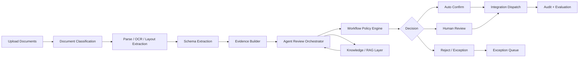

# IMPLEMENT_v3: Agentic Document Processing Platform Roadmap

## Objective

InsightDOC should evolve from an OCR and document workflow system into an Agentic Document Processing platform. The platform must support many document-centric use cases, not only a single workflow such as Comply TOR.

Target use cases include:

- Invoice and receipt processing
- TOR and procurement compliance review
- Contract review and clause risk analysis
- Cross-validation across multiple business documents
- Onboarding and KYC document checks
- Policy, checklist, and knowledge-based document validation
- Custom business logic workflows defined per customer or department

The core design principle is that every agentic capability must be configurable per workflow. Comply TOR should become one workflow template, not the platform architecture.

## Current Baseline

InsightDOC already has a usable foundation for agent-driven workflows:

- Job-based document grouping
- Document upload and processing
- Schema-based extraction
- Human review with confirm and reject decisions
- Integration dispatch
- Personal Access Tokens for API use
- External API namespace for agent access
- Downloadable `Softnix-InsightDOC` skill pack
- Name-based resolution for jobs, schemas, and integrations through the skill helper

This means the platform is already agent-ready. The next version should focus on reasoning, evidence, workflow configuration, knowledge grounding, and governance.

## Platform Concepts

### Workflow

A workflow is the top-level configuration for a document use case.

Examples:

- `Comply TOR`
- `Contract Risk Review`
- `Vendor Invoice Validation`
- `Customer Onboarding`
- `Loan Document Verification`

Each workflow should define:

- Expected document types
- Allowed schemas
- Required fields
- Business rules
- Knowledge collections to use
- Agent review policy
- Human review thresholds
- Integration targets
- Auto-confirm and reject policy

### Document Type

A document type describes a class of document inside a workflow.

Examples:

- TOR
- Quotation
- Purchase Order
- Invoice
- Receipt
- Contract
- Identity Document
- Company Certificate

Document type should not be inferred only from file name. The system should support classification using OCR text, layout, schema hints, and agent reasoning.

### Schema

Schemas remain the extraction contract, but they should evolve beyond flat field definitions.

Schemas should support:

- Field descriptions
- Required or optional fields
- Field-level validation rules
- Expected source area hints
- Value type and normalization rules
- Evidence requirements
- Confidence threshold
- Cross-field validation rules

### Knowledge Collection

Knowledge should be a first-class platform object, not hardcoded for one use case.

Examples:

- TOR compliance rules
- Contract playbook
- Procurement policy
- Vendor master data
- Product catalog
- Historical approved documents
- Regulatory checklist
- Customer-specific business rules

Each workflow can attach one or more knowledge collections. Agent behavior should be grounded by the workflow's selected knowledge, not by a global prompt.

### Policy

Policy defines what the agent is allowed to decide automatically.

Examples:

- Auto-confirm if all required fields have confidence above threshold
- Escalate if supplier name differs across documents
- Reject if mandatory document type is missing
- Ask human if legal clause is novel or high-risk
- Send integration only after every required document is confirmed

Policy should be versioned because business rules change over time.

## Target Architecture



## Development Plan

### Phase 1: Evidence and Confidence Layer

Goal: Make every extracted value verifiable.

Add field-level metadata to extracted and reviewed data:

- `value`
- `confidence`
- `source_text`
- `page_number`
- `bounding_box`
- `extraction_method`
- `normalization_method`
- `needs_review`
- `issues`

Expected outcome:

- Reviewers can verify a field without re-reading the whole document.
- Agents can reason from evidence instead of raw extracted values only.
- Future auto-confirm policies can be based on measurable confidence.

Implementation notes:

- Preserve backward compatibility with existing `extracted_data`.
- Store evidence as a structured object, not only display text.
- If the OCR provider does not return bounding boxes, start with `source_text` and `page_number`, then add visual coordinates later.

### Phase 2: Workflow Configuration Model

Goal: Turn use cases into configurable workflows.

Add platform models:

- `Workflow`
- `WorkflowDocumentType`
- `WorkflowSchemaBinding`
- `WorkflowPolicy`
- `WorkflowIntegrationBinding`

Workflow configuration should support:

- Which schemas are allowed
- Which document types are required
- Which knowledge collections are attached
- Which agent checks should run
- Which integrations are available
- Whether auto-confirm is allowed

Expected outcome:

- Comply TOR, contract review, and invoice validation become separate workflow records.
- Users can add future workflows without changing core code.

### Phase 3: Agent Review Orchestrator

Goal: Add a reasoning layer after extraction and before final decision.

The agent review should produce:

- Field completeness assessment
- Field-level issue list
- Cross-field validation findings
- Suggested corrections
- Recommended decision
- Required human questions
- Evidence references

Recommended agent decisions:

- `auto_confirm_candidate`
- `needs_human_review`
- `reject_candidate`
- `requires_reprocess`
- `requires_additional_documents`

Expected outcome:

- Human reviewers receive focused findings instead of raw OCR output.
- The agent can handle routine cases and escalate only uncertain or risky cases.

### Phase 4: Knowledge and RAG Layer

Goal: Support knowledge-grounded workflows across many use cases.

Add knowledge collection management:

- Upload knowledge documents
- Parse and index knowledge
- Attach knowledge collections to workflows
- Query knowledge from agent review
- Cite retrieved knowledge in review output

Knowledge collection examples:

- `Procurement Policy`
- `TOR Compliance Rules`
- `Contract Risk Playbook`
- `Vendor Master Data`
- `Accounting Rules`
- `KYC Checklist`

Expected outcome:

- Agent decisions become customer-specific and auditable.
- Comply TOR is implemented as one knowledge-backed workflow, not as a hardcoded feature.

### Phase 5: Multi-document Reasoning

Goal: Treat a job as a business case, not only a container of files.

Add job-level agent review:

- Required document checklist
- Cross-document entity matching
- Cross-document amount validation
- Date consistency checks
- Vendor or counterparty consistency checks
- Contract or TOR requirement coverage
- Missing document detection

Examples:

- Compare TOR requirements with quotation details.
- Compare purchase order amount with invoice amount.
- Compare contract party name with company certificate.
- Compare onboarding form with identity documents.

Expected outcome:

- The platform can support complex document packets and business logic validation.
- Review happens at both document level and job level.

### Phase 6: Policy Engine and HITL Guardrails

Goal: Define when the system can act autonomously and when it must ask a human.

Policy rules should support:

- Confidence thresholds
- Required field checks
- Required document type checks
- Cross-document rule results
- Knowledge-based rule results
- Risk level
- Integration readiness

Actions:

- Auto-confirm document
- Auto-confirm job
- Escalate to human review
- Reject document
- Reject job
- Request missing document
- Send to integration

Expected outcome:

- Autonomy is controlled by explicit policy instead of hidden prompt behavior.
- High-risk workflows can keep human approval while low-risk workflows can run automatically.

### Phase 7: Agent Tooling and Skill Pack v2

Goal: Make InsightDOC easier and safer for external AI agents.

Enhance `Softnix-InsightDOC` skill pack:

- Add workflow-aware commands
- Resolve workflow names
- Create jobs from workflow templates
- Upload document packets
- Run workflow review
- Poll document and job-level review status
- Ask for human input only when policy requires it
- Send integration only when workflow policy allows it

Possible helper commands:

```bash
./scripts/insightocr.sh workflows
./scripts/insightocr.sh create-job-from-workflow "Contract Risk Review" "Vendor A Contract"
./scripts/insightocr.sh upload-packet "Vendor A Contract" ./documents
./scripts/insightocr.sh run-workflow "Vendor A Contract"
./scripts/insightocr.sh review-job "Vendor A Contract"
./scripts/insightocr.sh send "Vendor A Contract" "Legal Review System"
```

Expected outcome:

- Agents can operate at workflow level, not only raw job and document level.
- Prompting becomes simpler and less error-prone.

### Phase 8: Evaluation and Governance

Goal: Make the platform measurable and production-safe.

Add evaluation capabilities:

- Field-level accuracy
- Document-level decision accuracy
- Job-level decision accuracy
- Human override rate
- Auto-confirm success rate
- Rejection false positive rate
- Integration success rate
- Average processing latency
- Cost per workflow run

Add governance metadata:

- Workflow version
- Schema version
- Policy version
- Prompt version
- Model version
- Knowledge collection version
- Agent action log

Expected outcome:

- Changes can be tested against known document sets.
- Production behavior is auditable and repeatable.

## Revised Priority

The revised priority is platform-first:

1. Evidence and confidence layer
2. Workflow configuration model
3. Agent review orchestrator
4. Knowledge and RAG layer
5. Multi-document reasoning
6. Policy engine and HITL guardrails
7. Skill Pack v2 for workflow-level automation
8. Evaluation and governance

This order avoids hardcoding Comply TOR and builds a reusable platform foundation for every future use case.

## What Changes From the Previous Plan

The earlier plan mentioned `Comply TOR Knowledge Base` as a specific next step. That is too narrow for the platform goal.

The revised approach is:

- Build a generic `Knowledge Collection` capability.
- Attach knowledge collections to workflows.
- Implement `Comply TOR` as one workflow configuration using that generic capability.
- Use the same structure for contract review, cross-document validation, onboarding, invoice validation, and future business logic workflows.

## Suggested First Milestone

Milestone 1 should deliver the minimum platform foundation for agentic processing:

- Add field evidence metadata.
- Add workflow records and workflow-schema bindings.
- Add agent review output model.
- Show agent review summary in document and job UI.
- Keep existing job, document, schema, and integration APIs backward compatible.

Acceptance criteria:

- A document can be processed and each extracted field can show evidence.
- A job can be assigned to a workflow.
- A workflow can define allowed schemas and review policy.
- Agent review can output structured issues and a suggested decision.
- Human reviewer can confirm or reject with visibility into agent findings.

## Production Principles

- Every autonomous decision must be explainable.
- Every important output must link to document evidence or knowledge evidence.
- Workflow behavior must be configurable and versioned.
- Agents must operate through audited APIs and PAT permissions.
- Human review should be focused on uncertainty, not used as the default fallback for every case.
- New use cases should be added as workflow configuration whenever possible, not as new hardcoded pipelines.
