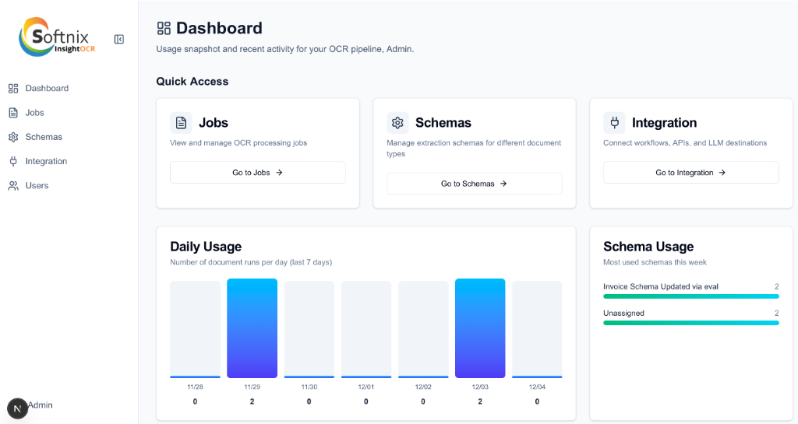
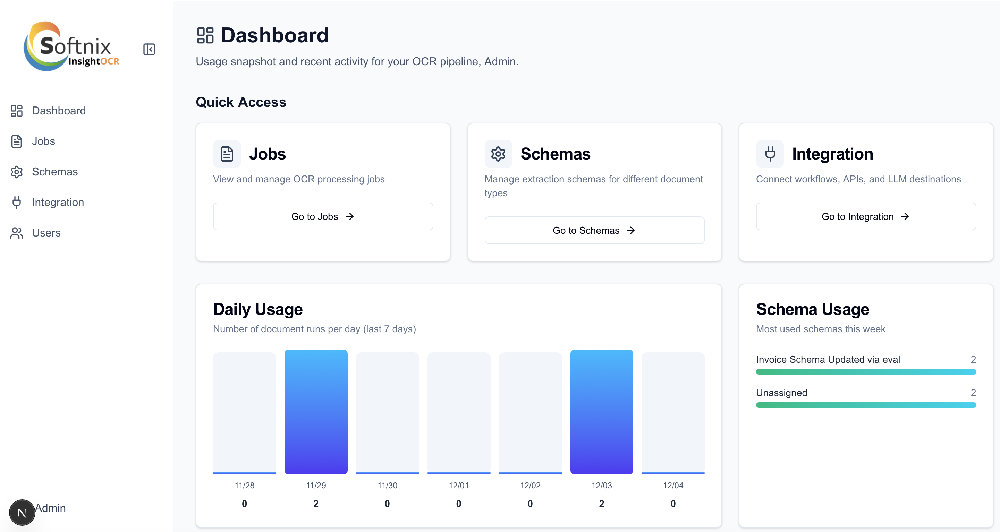

# InsightOCR

A modern document processing system with OCR (Optical Character Recognition) and structured data extraction capabilities. Built with FastAPI backend and Next.js (App Router) frontend.



## Features

- 🔐 **User Management & Authentication** - Role-based access control (Admin, Manager, User)
- 📄 **Document Schema Management** - Define custom extraction schemas for different document types
- 📋 **Job-based Processing** - Organize documents into jobs for batch processing
- 🔍 **OCR Processing** - Extract text from PDF and image files
- 🎯 **Structured Data Extraction** - Convert OCR text to structured JSON based on schemas
- ✏️ **Review & Edit** - Review and correct extracted data before saving
- ⚙️ **Configurable Settings** - Manage API endpoints and credentials through UI

## Tech Stack

### Backend
- **FastAPI** - Modern Python web framework
- **PostgreSQL** - Database
- **SQLAlchemy** - ORM
- **Pydantic** - Data validation

### Frontend
- **Next.js 16** - React framework
- **TypeScript** - Type safety
- **Tailwind CSS** - Styling

## Getting Started

### Prerequisites

- Docker & Docker Compose
- Git

### Installation (Docker, recommended)

1) Clone the repository:
```bash
git clone https://github.com/rujirapongsn2/InsightOCRv2.git
cd InsightOCRv2
```

2) Create environment files (root + backend + frontend):
```bash
# Root (docker compose)
cp .env.example .env

# Backend
cp backend/.env.dev.example backend/.env   # หรือใช้ .env.prod.example ถ้า deploy

# Frontend
cp frontend/.env.development.example frontend/.env.local
```
- แก้ค่าใน `.env`, `backend/.env`, `frontend/.env.local` ให้ครบถ้วน (ดู `ENV_SETUP.md` และไฟล์ *.example เป็นแนวทาง)
- คีย์สำคัญ: `SECRET_KEY`, `DATABASE_URL`, `BACKEND_CORS_ORIGINS`, `NEXT_PUBLIC_API_URL`, OCR endpoints/keys

3) Start services (เลือกวิธีใดวิธีหนึ่ง):
```bash
docker compose up -d        # หรือ
./scripts/services.sh up    # helper script
```

4) Setup gateway/nginx (จำเป็นหลังขึ้น container แล้ว):
```bash
./scripts/setup/setup-nginx.sh
```

5) ตรวจสอบ services และ network isolation:
- จะมีอย่างน้อย 8 services (backend, frontend, nginx, gateway, db, redis, minio, celery_worker)  
  ตรวจสอบด้วย: `docker ps`
- ยืนยัน isolation (ตัวอย่าง):  
  `docker compose exec redis ping -c1 8.8.8.8` ➜ ควร `Network unreachable`  
  `docker compose exec backend curl -k https://<external-api>/me` ➜ ควรเข้าถึงได้ผ่าน gateway proxy

6) Access the application:
- Frontend: http://localhost:3000
- Backend API: http://localhost:8000
- API Docs: http://localhost:8000/docs

### Default Credentials

- **Admin**: admin@example.com / admin

## Service Management

The project includes a helper script (`scripts/services.sh`) to manage Docker services easily:

### Quick Commands

```bash
# Start all services (with rebuild)
scripts/services.sh up

# Stop all services
scripts/services.sh down

# Restart specific service
scripts/services.sh restart web      # Restart frontend
scripts/services.sh restart api      # Restart backend
scripts/services.sh restart all      # Restart all services

# View logs (real-time)
scripts/services.sh logs web         # Frontend logs
scripts/services.sh logs api         # Backend logs

# Check service status
scripts/services.sh ps
```

### When to Use Each Command

**`restart web` / `restart api`**
- After installing new npm packages
- After code changes that need container restart
- When service is not responding
- Much faster than full rebuild

**`up`**
- First time setup
- After Dockerfile changes
- After adding new environment variables
- After docker-compose.yml changes

**`down`**
- Stop all services to free resources
- Before switching branches with major changes
- When troubleshooting Docker issues

**`logs`**
- Debug runtime errors
- Monitor application behavior
- Watch for API request/response
- Ctrl+C to stop following logs

### Service Aliases

The script accepts multiple aliases for convenience:
- `web` or `frontend` - Next.js frontend
- `api` or `backend` - FastAPI backend

### Examples

```bash
# Install new package and restart frontend
cd frontend
npm install react-pdf pdfjs-dist
cd ..
scripts/services.sh restart web

# View backend error logs
scripts/services.sh logs api

# Full restart after major changes
scripts/services.sh down
scripts/services.sh up
```

## Usage Workflow

### 1. Configure Settings

Navigate to `/settings` and configure:
- API Endpoint (OCR service URL)
- API Token (Authentication key)
- OCR Engine (optional)
- Model (optional)

### 2. Create Document Schema

1. Go to `/schemas`
2. Click "Create Schema"
3. Define fields to extract (name, type, description)
4. Optionally, import from JSON Schema

### 3. Process Documents

1. Create a new Job (`/jobs/create`)
2. Upload documents
3. Select schema for each document
4. Click "Process" or "Process All"
5. Review extracted data
6. Save changes

## UI Preview



## Project Structure

```
InsightOCRv2/
├── backend/
│   ├── app/
│   │   ├── api/          # API endpoints
│   │   ├── models/       # Database models
│   │   ├── schemas/      # Pydantic schemas
│   │   ├── services/     # Business logic (OCR, Structure)
│   │   └── core/         # Configuration
│   └── Dockerfile
├── frontend/
│   ├── app/              # Next.js pages
│   ├── components/       # React components
│   └── Dockerfile
└── docker-compose.yml
```

## External API Configuration

InsightOCR integrates with an external AI service for OCR processing and structured data extraction. The external API provides the following endpoints:

### 1. Authentication Test Endpoint
- **URL**: `https://111.223.37.41:9001/me`
- **Purpose**: Test API authentication and verify endpoint connectivity
- **Method**: GET
- **Headers**: `Authorization: Bearer <API_TOKEN>`
- **Response**: User/service information
- **Usage**: Used by the Settings page "Test Endpoint" button

### 2. OCR Extraction Endpoint
- **URL**: `https://111.223.37.41:9001/ai-process-file`
- **Purpose**: Extract text from PDF/image documents using OCR
- **Method**: POST
- **Input**: File (PDF, JPG, PNG)
- **Output**: Extracted OCR text
- **Usage**: Core OCR processing for document text extraction

### 3. Structured Output Endpoint
- **URL**: `https://111.223.37.41:9001/structured-output`
- **Purpose**: Convert OCR text to structured JSON based on a defined schema
- **Method**: POST
- **Input**:
  - OCR text content
  - JSON Schema definition (fields, types, descriptions)
- **Output**: Structured JSON data matching the schema
- **Usage**: Transform extracted text into structured data for review and export

### Configuration in Settings

Navigate to `/settings` and configure the external API endpoints:

1. **OCR Processing Endpoint**: `https://111.223.37.41:9001/ai-process-file`
   - Used for extracting text from uploaded documents
   - POST request with file upload

2. **Test Connection Endpoint**: `https://111.223.37.41:9001/me`
   - Used to verify API authentication
   - GET request to test connectivity

3. **Bearer Token**: Your API authentication token (e.g., `ocr_ai_key_987654321fedcba`)
   - Used for authenticating requests to both endpoints

4. Click **"Test Connection"** to verify connectivity
5. Click **"Save Connection Settings"** to persist configuration

**Note**: The system now uses separate endpoints for different operations:
- Test connection → `test_endpoint` (/me)
- OCR extraction → `ocr_endpoint` (/ai-process-file)
- Data structuring → `/structured-output` (called during document processing)

### AI Field Suggestion Configuration (Optional)

The system includes an **AI-Assisted Field Suggestion** feature for automatically suggesting schema fields from sample documents. This feature is **separate** from the core OCR processing and requires additional configuration.

**Important**: The AI Field Suggestion feature requires a compatible AI provider API (e.g., Dify.ai, OpenAI) that can analyze OCR content and suggest structured fields. This is NOT the same as the OCR extraction endpoint above.

To configure AI Field Suggestion:
1. Navigate to `/settings`
2. Scroll to **"AI Field Suggestion"** section (below the API Endpoint section)
3. Click **"Add Provider"**
4. Configure your AI provider:
   - **Provider Name**: Unique identifier (e.g., "dify-ai")
   - **Display Name**: Human-readable name
   - **API URL**: Your AI provider's API endpoint (e.g., `https://api.dify.ai/v1/workflows/run`)
   - **API Key**: Authentication key from your AI provider
   - **Is Active**: Enable the provider
   - **Is Default**: Set as default provider
5. Click **"Test Connection"** to verify
6. Click **"Save"**

**Usage**:
- When creating a schema via **Simple Mode** (`/schemas/new/simple`)
- Upload a sample document
- The system will extract OCR text and send it to the configured AI provider
- AI will suggest relevant fields based on the document content

**Troubleshooting**:
- If you see "OCR extraction failed: 400 Client Error", check that your AI provider URL is correct
- The AI provider endpoint must support field suggestion from OCR content
- If no AI provider is configured, use **Advanced Mode** to create schemas manually

### Common Issues and Solutions

**Error: "OCR extraction failed: 500 Internal Server Error"**
- **Cause**: OCR endpoint not configured or incorrect endpoint URL
- **Solution**:
  1. Go to `/settings`
  2. Verify **OCR Processing Endpoint** is set to `/ai-process-file` (not `/me`)
  3. Verify **Bearer Token** is correct
  4. Click "Save Connection Settings"
  5. Click "Test Connection" to verify

**Error: "API Settings not configured"**
- **Cause**: No settings saved in database
- **Solution**:
  1. Login as admin user
  2. Go to `/settings`
  3. Configure both OCR and Test endpoints
  4. Save settings

**Error: "400 Bad Request" when testing connection**
- **Cause**: Using wrong endpoint for the operation
- **Solution**:
  - Test Connection uses GET request to `/me`
  - OCR Processing uses POST request to `/ai-process-file`
  - Ensure you're using the correct endpoint for each purpose

## Environment Variables

### Quick Start
Use the provided `.env.example` templates to get started:

**Development:**
- `backend/.env.dev.example` → `backend/.env`
- `frontend/.env.development.example` → `frontend/.env.local`

**Production:**
- `backend/.env.prod.example` → `backend/.env`
- `frontend/.env.production.example` → `frontend/.env.local`

### Backend Variables

#### Required
- `SECRET_KEY` - JWT token signing key (generate with `openssl rand -hex 32`)
- `DATABASE_URL` - PostgreSQL connection string
- `REDIS_URL` - Redis connection string for Celery task queue
- `BACKEND_CORS_ORIGINS` - Allowed frontend origins (comma-separated)

#### Storage
- `STORAGE_TYPE` - Options: `local`, `minio`, `s3`
- `MINIO_*` - Required if `STORAGE_TYPE=minio`
- `AWS_*` - Required if `STORAGE_TYPE=s3`

#### OCR Service (New!)
- `OCR_ENDPOINT` - External OCR service endpoint for document processing
- `TEST_ENDPOINT` - OCR service health check endpoint

**Note:** These provide default values when no database setting exists. Can be overridden via UI Settings page.

#### Optional
- `BACKEND_EXTRA_CORS_ORIGINS` - Additional CORS origins
- `OPENAI_API_KEY` - OpenAI API key (optional)
- `AI_PROVIDER_URL` - Custom AI provider endpoint (optional)
- `AI_PROVIDER_KEY` - Custom AI provider API key (optional)

### Frontend Variables
- `NEXT_PUBLIC_API_URL` - Backend API URL (must include `/api/v1`)

### Detailed Configuration
See [ENV_SETUP.md](ENV_SETUP.md) for:
- Complete variable descriptions
- Environment-specific configurations
- Common issues and troubleshooting
- Testing configuration
- Security best practices

## Development

### Running Tests

Tests are not yet automated. When adding coverage, colocate:
- Backend: `backend/tests/test_*.py` with `pytest`
- Frontend: `frontend/**/*.test.tsx` with React Testing Library/Jest

### Database Migrations

Automatic schema alignment occurs on startup via guarded `ALTER TABLE` in `backend/app/main.py`. Add explicit migrations if introducing breaking schema changes.

## Security

- ✅ No hardcoded API credentials in code
- ✅ Settings stored in database
- ✅ Role-based access control
- ✅ JWT authentication (if implemented)

## Contributing

1. Fork the repository
2. Create a feature branch
3. Commit your changes
4. Push to the branch
5. Create a Pull Request

## License

[Add your license here]

## Support

For issues and questions, please open an issue on GitHub.

## Acknowledgments

- Built with FastAPI and Next.js
- OCR powered by external API service
